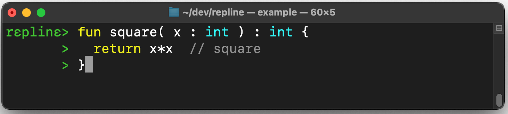
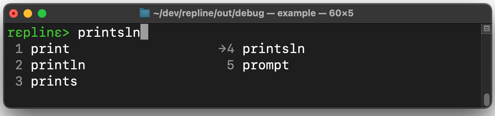
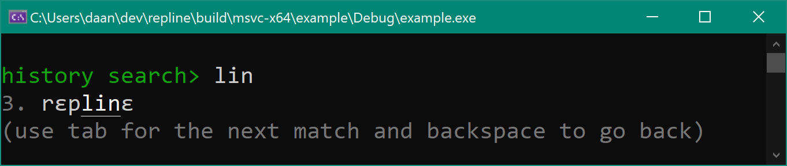

<!--  -->



# Repline> <br>a portable readline alternative.

Repline is a pure C library that can be used as readline alternative. 

- Small: less than 6k lines and can be compiled as a single C file without 
  any dependencies or configuration (e.g. `gcc -c src/repline.c`).
  
- Portable: works on Unix, Windows, and macOS, and uses a minimal
  subset of ANSI escape sequences.
    
- Features: extensive multi-line editing mode (`shift-tab`), colors, history, completion, unicode, 
  undo/redo, incremental history search, inline hints, syntax highlighting, graceful fallback, support for custom allocators, etc.
  
- License: MIT. 

- Comes with a [Haskell] binding (`System.Console.Repline`).

Enjoy,
  Daan
  
<!--   -->
  
# Demo

  

Shows in order: syntax highlighting, multiline editing, inline hinting, filename completion, and incremental history search.

# Usage

Include the repline header in your C or C++ source:
```C
#include <include/repline.h>
```

and call `rp_readline` to get user input with rich editing abilities:
```C
char* input;
while( (input = rp_readline("prompt")) != NULL ) { // ctrl+d/c or errors return NULL
  printf("you typed:\n%s\n", input); // use the input
  free(input);  
}
```

See the [example] for a full example with completion, history, etc.


# Run the Example

You can compile and run the [example] as:
```
$ gcc -o example -Iinclude test/example.c src/repline.c
$ ./example
```

or, the Haskell [example][HaskellExample]:
```
$ ghc -ihaskell test/Example.hs src/repline.c
$ ./test/Example
```


# Editing with Repline

Repline tries to be as compatible as possible with standard [GNU Readline] key bindings.

### Overview:
```apl
       home/ctrl-a       cursor     end/ctrl-e
         ┌─────────────────┼───────────────┐    (navigate)
         │     ctrl-left   │  ctrl-right   │
         │         ┌───────┼──────┐        │    ctrl+r   : search history
         ▼         ▼       ▼      ▼        ▼    tab      : complete word
  prompt> it is the quintessential language     shift-tab: insert new line
         ▲         ▲              ▲        ▲    esc      : delete line, done
         │         └──────────────┘        │    ctrl+z   : undo
         │    alt-backsp        alt-d      │
         └─────────────────────────────────┘    (delete)
       ctrl-u                          ctrl-k
```

### Key Bindings

These are also shown when pressing `F1` on a Repline prompt. We use `^` as a shorthand for `ctrl-`:

| Navigation        |                                                 |
|-------------------|-------------------------------------------------|
| `left`,`^b`       | go one character to the left |
| `right`,`^f   `   | go one character to the right |
| `up           `   | go one row up, or back in the history |
| `down         `   | go one row down, or forward in the history |
| `^left        `   | go to the start of the previous word |
| `^right       `   | go to the end the current word |
| `home`,`^a    `   | go to the start of the current line |
| `end`,`^e     `   | go to the end of the current line |
| `pgup`,`^home `   | go to the start of the current input |
| `pgdn`,`^end  `   | go to the end of the current input |
| `^p           `   | go back in the history |
| `^n           `   | go forward in the history |
| `^r`,`^s      `   | search the history starting with the current word |
  

| Deletion        |                                                 |
|-------------------|-------------------------------------------------|
| `del`,`^d     `   | delete the current character |
| `backsp`,`^h  `   | delete the previous character |
| `^w           `   | delete to preceding white space |
| `alt-backsp   `   | delete to the start of the current word |
| `alt-d        `   | delete to the end of the current word |
| `^u           `   | delete to the start of the current line |
| `^k           `   | delete to the end of the current line |
| `esc          `   | delete the current line, or done with empty input |
  

| Editing           |                                                 |
|-------------------|-------------------------------------------------|
| `enter        `   | accept current input |
| `^enter`,`^j`,`shift-tab` | create a new line for multi-line input |
| `^l           `   | clear screen |
| `^t           `   | swap with previous character (move character backward) |
| `^z`,`^_      `   | undo |
| `^y           `   | redo |
| `tab          `   | try to complete the current input |
  

| Completion menu   |                                                 |
|-------------------|-------------------------------------------------|
| `enter`,`left`    | use the currently selected completion |
| `1` - `9`         | use completion N from the menu |
| `tab, down    `   | select the next completion |
| `shift-tab, up`   | select the previous completion |
| `esc          `   | exit menu without completing |
| `pgdn`,`^enter`,`^j`   | show all further possible completions |
  

| Incremental history search        |                                                 |
|-------------------|-------------------------------------------------|
| `enter        `   | use the currently found history entry |
| `backsp`,`^z  `   | go back to the previous match (undo) |
| `tab`,`^r`,`up`   | find the next match |
| `shift-tab`,`^s`,`down`  | find an earlier match |
| `esc          `   | exit search |


# Build the Library

See the Haskell [readme][Haskell] for instructions to build the Haskell library.


### Build with CMake

Clone the repository and run cmake to build a static library (`.a`/`.lib`):
```
$ git clone https://github.com/daanx/repline
$ cd repline
$ mkdir -p build/release
$ cd build/release
$ cmake ../..
$ cmake --build .
```
This builds a static library `librepline.a` (or `repline.lib` on Windows)
and the example program:
```
$ ./example
```

### Build as a Single Source

Copy the sources (in `include` and `src`) into your project, or add the library as a [submodule]:
```
$ git submodule add https://github.com/daanx/repline
```
and add `repline/src/repline.c` to your build rules -- no configuration is needed. 


# C Interface

See [repline.h](https://github.com/daanx/repline/blob/main/include/repline.h) for the full API,
and the [example] for example usage of history, completion, etc.


# Motivation

Repline was created for use in the [Koka] interactive compiler. 
This required: pure C (no dependency on a C++ runtime or other libraries), 
portable (across Linux, macOS, and Windows), unicode support, 
a BSD-style license, and good functionality for completion and multi-line editing.

Some other excellent libraries that we considered:
[GNU readline],
[editline](https://github.com/troglobit/editline),
[linenoise](https://github.com/antirez/linenoise),
[replxx](https://github.com/AmokHuginnsson/replxx), and 
[Haskeline](https://github.com/judah/haskeline).

[GNU readline]: https://tiswww.case.edu/php/chet/readline/rltop.html
[koka]: http://www.koka-lang.org
[submodule]: https://git-scm.com/book/en/v2/Git-Tools-Submodules
[Haskell]: https://github.com/daanx/repline/tree/main/haskell
[HaskellExample]: https://github.com/daanx/repline/blob/main/test/Example.hs
[example]: https://github.com/daanx/repline/blob/main/test/example.c

<!--
## Potential Future Extensions

- Syntax highlighting
- Parenthesis matching
- Vi mode
-->
