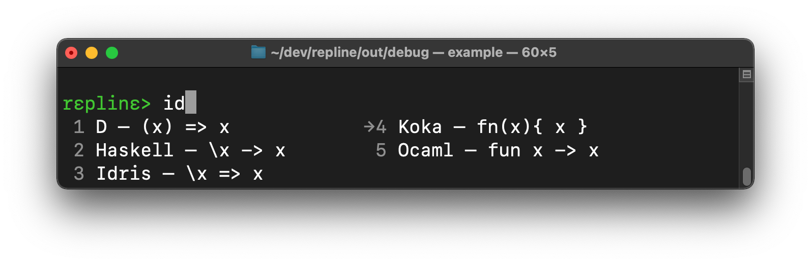

# Repline> <br>a portable readline alternative.

Repline is a pure C library that can be used as readline alternative. 

- Small: less than 5k lines and can be compiled as a single C file without 
  any dependencies or configuration (e.g. `gcc -c src/repline.c`).
- Portable: works on Unix, Windows, and macOS, and relies on a minimal
  subset of ANSI escape sequences.
- Features: extensive multi-line editing mode, colors, history, completion, unicode, 
  undo/redo, incremental history search, graceful fallback, etc.
- License: MIT.
- Comes with a [Haskell] binding (`System.Console.Repline`).

Enjoy,
  Daan

# Usage

Include the repline header in your C or C++ source:
```C
#include <include/repline.h>
```

and call `rp_readline` to get user input with rich editing abilities:
```C
char* input;
while( (input = rp_readline("prompt")) != NULL ) { // ctrl+d/c or errors return NULL
  printf("you typed:\n%s\n", input); // use the input
  free(input);  
}
```

See the [example] for a full example with completion, history, etc.


# Run the Example

You can compile and run the [example] as:
```
$ gcc -o example -Iinclude test/example.c src/repline.c
$ ./example
```

or, the Haskell [example][HaskellExample]:
```
$ ghc -ihaskell test/Example.hs src/repline.c
$ ./test/Example
```


# Editing with Repline

Repline tries to 


# Build the Library

## CMake

Clone the repository and run cmake to build a static library (`.a`/`.lib`):
```
$ git clone https://github.com/daanx/repline
$ cd repline
$ mkdir -p build/release
$ cd build/release
$ cmake ../..
$ cmake --build .
```

and run the example program:
```
$ ./example
```

See the Haskell [readme][Haskell] for instructions to build the Haskell library.


## As a Single Source

Copy the sources (in `include` and `src`) into your project, or add the library as a [submodule]:
```
$ git submodule add https://github.com/daanx/repline
```
and add `repline/src/repline.c` to your build rules -- no configuration is needed. 

# Motivation

Repline was created for use in the [Koka] interactive compiler. 
This required: pure C (no dependency on a C++ runtime or other libraries), 
portable (across Linux, macOS, and Windows), unicode support, 
a BSD-style license, and good functionality for completion and multi-line editing.

Some other libraries that we considered:
[GNU readline](https://tiswww.case.edu/php/chet/readline/rltop.html),
[editline](https://github.com/troglobit/editline),
[linenoise](https://github.com/antirez/linenoise),
[replxx](https://github.com/AmokHuginnsson/replxx).

[koka]: http://www.koka-lang.org
[submodule]: https://git-scm.com/book/en/v2/Git-Tools-Submodules
[Haskell]: https://github.com/daanx/repline/tree/main/haskell
[HaskellExample]: https://github.com/daanx/repline/blob/main/test/Example.hs
[example]: https://github.com/daanx/repline/blob/main/test/example.c

<!--
## Potential Future Extensions

- Syntax highlighting
- Parenthesis matching
- Vi mode
-->
